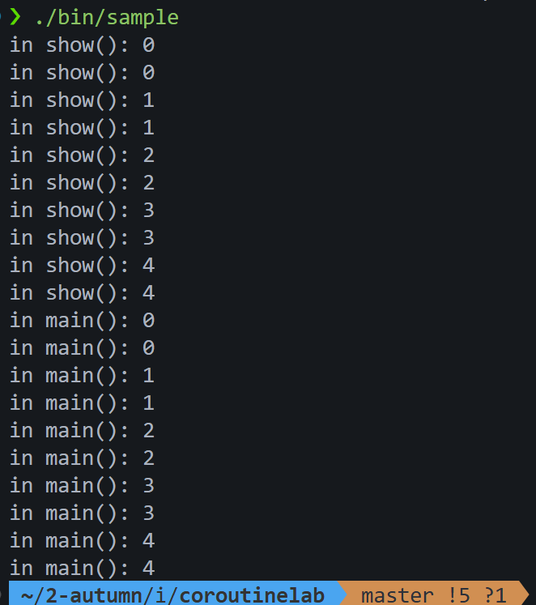
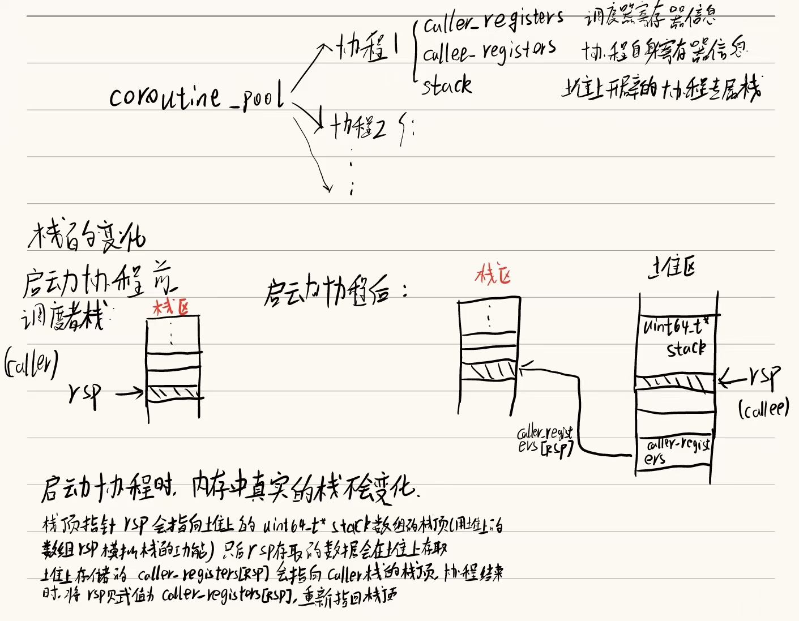
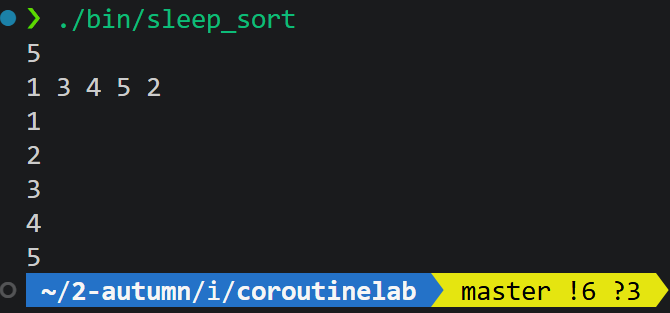
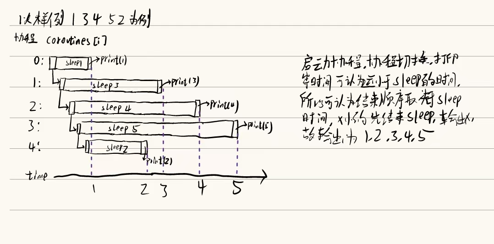
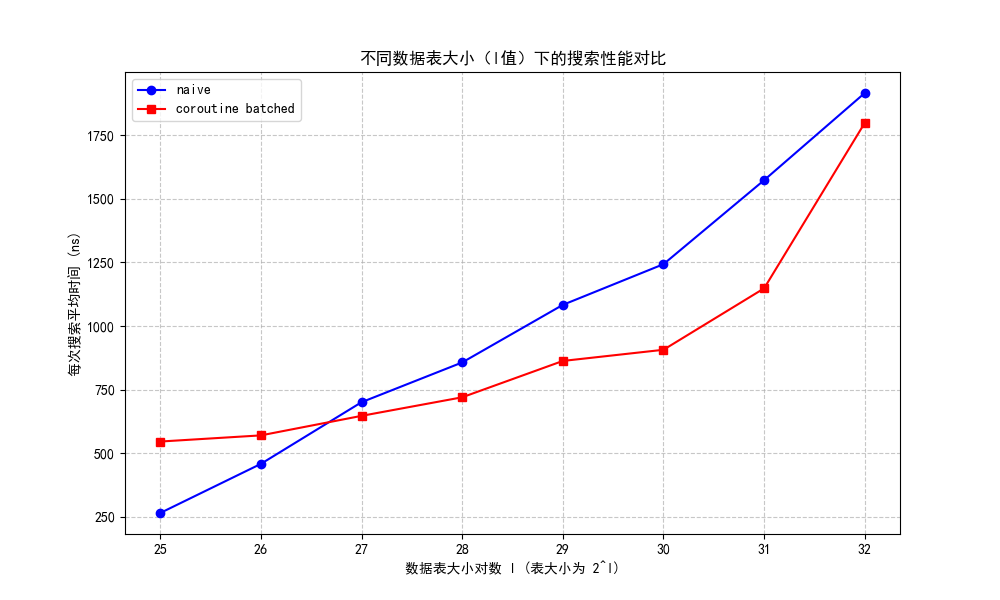
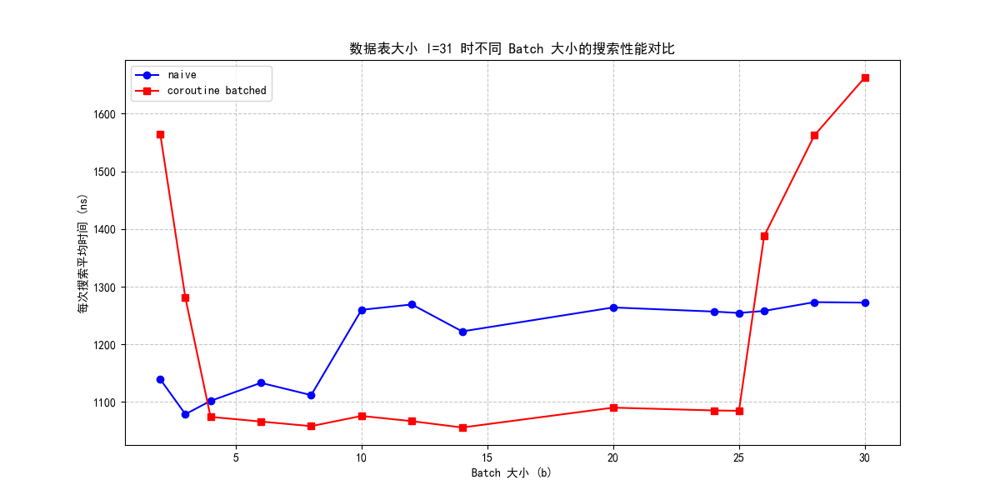

### 胡皓然 2024010671 计41

### 整体调用过程
1. 创建协程池，并且将协程对象放入协程池中
2. 协程对象中包含：
   1. 协程执行的函数：F f
   2. 协程函数的参数：std::tuple<Args...> args（使用tuple来进行保存）
   3. 继承 basic_context，保存协程的寄存器和栈信息
   4. 构造函数，初始化协程函数和参数，并且设置协程栈信息
   5. 开始运行协程，暂停协程，重新恢复运行等函数
3. 调用serial_execute_all() ，此时会轮询协程池中的协程，如果未完成并且已经ready了，则开始执行该协程
4. 使用resume()函数，其中会调用coroutine_switch()接口开始执行汇编部分，此时会：
   1. 保存调度器协程的寄存器信息于caller_registers数组中
   2. 根据协程对象的callee_registers数组中的信息来恢复协程的寄存器状态
       * 注意，此时的callee_registers中rsp初始化成了专属栈的栈顶地址（因为专属栈的隔离，所以其实只需要将rsp指向专属栈的栈顶即可完成栈状态的恢复）
       * rip为coroutine_entry的入口地址
       * r12 寄存器为 coroutine_main 的地址
       * r13 寄存器为 coroutine_main 的参数，即当前协程对象的地址
5. 执行完切换函数后，由于rip被恢复成了coroutine_entry的入口地址，所以开始调用coroutine_entry()
6. corotine_entry()也是一个汇编接口，会将r13中存的当前协程对象的地址传入rdi（也就是作为参数），然后调用coroutine_main,开始执行该协程
7. coroutine_main中会调用run函数，run函数会进行宏展开，然后开始执行协程的函数f
   1. 如果执行过程中调用yield(),则会调用coroutine_switch()接口，此时会将保存当前的寄存器状态到callee_registers数组中，并且通过caller_registers数组恢复调度器的寄存器状态
      * 注意切入协程和切出协程的调用参数顺序不同，切入的时候是保存到caller_registers中，切出的时候是保存到callee_registers中 
   2. 如果没有调用yield(),而是执行完了整个协程，则会回到coroutine_main()中，此时会将该协程对象标记为finished，然后调用coroutine_switch()接口，将寄存器状态恢复到调度器的状态，继续循环 
 
 ### Task 1
 #### 填充的代码
 1. common.h
   yield()函数，用于实现协程的切出
   ```cpp
   void yield() {
      if (!g_pool->is_parallel) {
         // 从 g_pool 中获取当前协程状态
         auto context = g_pool->coroutines[g_pool->context_id];
         // 调用 coroutine_switch 切换到 coroutine_pool 上下文
         // 第一个参数是保存当前状态（callee），第二个参数是恢复到的状态（caller）
         coroutine_switch(context->callee_registers, context->caller_registers);
      }
   }
   ```
 2. context.h
 resume()函数，用于开始协程
 ```cpp
   virtual void resume() {
    // 调用 coroutine_switch
    // 在汇编中保存 callee-saved 寄存器，设置协程函数栈帧，然后将 rip 恢复到协程 yield 之后所需要执行的指令地址。
    // 第一个参数是保存当前状态（caller），第二个参数是恢复到的状态（callee）
    coroutine_switch(caller_registers, callee_registers);
  }
 ```
 3. coroutine.h
 协程的调度执行
 ```cpp
 while(cnt > 0) {
      for(int i = 0; i < coroutines.size(); i++) {
        auto context = coroutines[i];
        if(context->finished) {
          continue;
        }
        //! 注意要设置当前正在执行的协程id
        context_id = i;
        // 使用resume，会切换到协程并且执行
        context->resume();
        // 如果结束了，则数量减1
        if(context->finished) {
          cnt--;
        }
        
      }
    }
   ```
   4. context.S
   实现coroutine_switch()接口，用于切换协程的寄存器状态
   ```asm
    # 保存 callee-saved 寄存器到 %rdi 指向的上下文
    # 对于caller-saved寄存器，如果有用的话在调用协程切换函数的时候就会进行保留了
    # 保存的上下文中 rip 指向 ret 指令的地址（.coroutine_ret）
    # 第一个参数中保存当前的状态
    # 根据寄存器枚举类来确定各个寄存器的保存顺序
    movq %rsp, 64(%rdi)
    movq %rbx, 72(%rdi)
    movq %rbp, 80(%rdi)
    movq %r12, 88(%rdi)
    movq %r13, 96(%rdi)
    movq %r14, 104(%rdi)
    movq %r15, 112(%rdi)
    # rip保存为 .coroutine_ret的地址(这里是rip相对寻址)
    leaq .coroutine_ret(%rip), %rax
    movq %rax, 120(%rdi)


    # 从 %rsi 指向的上下文恢复 callee-saved 寄存器
    # 最后 jmpq 到上下文保存的 rip
    movq 64(%rsi), %rsp
    movq 72(%rsi), %rbx
    movq 80(%rsi), %rbp
    movq 88(%rsi), %r12
    movq 96(%rsi), %r13
    movq 104(%rsi), %r14
    movq 112(%rsi), %r15
    # jmp到保存的rip处（其实就是entry）
    jmpq *120(%rsi)
   ```
 #### 通过测试用例，验证了协程的基本功能：
 
 #### 栈变化的过程
 
 #### 协程如何开始执行
 1. 协程的初始状态
 每个协程被创建为一个结构coroutine_context，其中包含了
      1. 协程执行的函数：F f
      2. 协程函数的参数：std::tuple<Args...> args（使用tuple来进行保存）
      3. 继承 basic_context，保存协程的寄存器和栈信息
      4. 构造函数，初始化协程函数和参数，并且设置协程栈信息
      5. 开始运行协程，暂停协程，重新恢复运行等函数
      ```cpp
      uint64_t *stack;
      uint64_t stack_size;
      // 调度器协程的状态
      uint64_t caller_registers[(int)Registers::RegisterCount];
      // 当前协程本身的状态
      uint64_t callee_registers[(int)Registers::RegisterCount];
      F f;
      std::tuple<Args...> args;
      ```
    在构造函数中，在堆上开辟一块内存stack，用来模拟协程的栈,并且使用变量rsp指向16位对齐的栈顶地址
      协程的寄存器状态数组中，rip设置为coroutine_entry的入口地址，rsp设置为16位对齐的栈顶地址，r12设置为coroutine_main的入口地址，r13设置为当前协程对象的地址
      ```cpp
      stack = new uint64_t[stack_size];
         // 对齐到 16 字节边界
         uint64_t rsp = (uint64_t)&stack[stack_size - 1];
         rsp = rsp - (rsp & 0xF);
         void coroutine_main(struct basic_context * context);
         callee_registers[(int)Registers::RSP] = rsp;
         // 协程入口是 coroutine_entry
         callee_registers[(int)Registers::RIP] = (uint64_t)coroutine_entry;
         // 设置 r12 寄存器为 coroutine_main 的地址
         callee_registers[(int)Registers::R12] = (uint64_t)coroutine_main;
         // 设置 r13 寄存器，用于 coroutine_main 的参数
         callee_registers[(int)Registers::R13] = (uint64_t)this;
      ```

2. context_switch()
   serial_execute_all()中启动某个协程，此时会调用resume函数，启动context_switch接口，通过汇编代码保存当前调度器协程的状态，然后将当前的寄存器状态恢复到协程的状态，继续执行协程函数
    ```cpp
    void resume() {
      // 调用 coroutine_switch
      // 在汇编中保存 callee-saved 寄存器，设置协程函数栈帧，然后将 rip 恢复到协程 yield 之后所需要执行的指令地址。
      // 第一个参数是保存当前状态（caller），第二个参数是恢复到的状态（callee）
      coroutine_switch(caller_registers, callee_registers);
    }
    ```
    * 保存当前状态：将当前的寄存器状态保存到caller_registers数组中
   ```asm
   movq %rsp, 64(%rdi)
    movq %rbx, 72(%rdi)
    movq %rbp, 80(%rdi)
    movq %r12, 88(%rdi)
    movq %r13, 96(%rdi)
    movq %r14, 104(%rdi)
    movq %r15, 112(%rdi)
    # rip保存为 .coroutine_ret的地址(这里是rip相对寻址)
    leaq .coroutine_ret(%rip), %rax
    movq %rax, 120(%rdi)
   ```
   * 恢复状态：将协程的寄存器状态从callee_registers数组中恢复到当前寄存器中
   ```asm
   # 从 %rsi 指向的上下文恢复 callee-saved 寄存器
    # 最后 jmpq 到上下文保存的 rip
    movq 64(%rsi), %rsp
    movq 72(%rsi), %rbx
    movq 80(%rsi), %rbp
    movq 88(%rsi), %r12
    movq 96(%rsi), %r13
    movq 104(%rsi), %r14
    movq 112(%rsi), %r15
    # jmp到保存的rip处（其实就是entry）
    jmpq *120(%rsi)
   ```
   执行完状态切换之后，此时的寄存器状态如下：
   * %rsp指向协程的专属栈stack的栈顶
   * %rip中存放了coroutine_entry的入口地址
   * %r12中存放了coroutine_main的入口地址
   * %r13中存放了当前协程对象的地址
3. coroutine_entry()
   完成context_switch后，下一步会跳转到coroutine_entry的入口地址，在coroutine_entry中，会调用coroutine_main函数，开始执行协程函数
   ```asm
   .coroutine_entry:
    # 传递协程对象指针作为参数
    movq %r13, %rdi
    # 调用 coroutine_main
    callq *%r12
   ```
4. coroutine_main()
   coroutine_main()是协程的统一入口函数，所有的协程函数都必须通过coroutine_main来执行
   ```cpp
   void coroutine_main(struct basic_context * context) {
      // 多态调用，开始运行协程
      context->run();
      context->finished = true;
      coroutine_switch(context->callee_registers, context->caller_registers);
      // unreachable
      assert(false);
   }
   ```
   其中会调用协程的run()函数，run函数中会通过宏定义展开来调用协程函数
   ```cpp
   virtual void run() { CALL(f, args); }
   ```
   如果函数正常结束，则标记次此协程完成，并调用 coroutine_switch(callee_registers, caller_registers)切换回原本的调度器协程。
   如果协程执行的函数里有 yield 函数，那么 yield 函数会主动调用 coroutine_switch(context->callee_registers,context->caller_registers) 将协程停止并挂起，然后恢复调用此协程的caller函数的运行状态。

### Task 2
#### 实现原理
1. 当协程调用sleep(ms)的时候，会记录当前的时间并且设置一个超时检测函数
2. 将当前协程标记为未就绪状态，并且让出控制权
3. 调度器在轮询的时候会调用每个未就绪函数的ready_func，检测是否已经超过了指定的睡眠时间
4. 如果超过了，则将协程标记为就绪并且执行，如果没有，继续轮询

* 精度问题
会出现轮询延迟，协程调用sleep后会立刻让出让出控制权，但是只有当下一次轮询到他的时候才会去检查是否超时
如果其他协程的执行时间较长，可能会导致sleep的协程长时间得不到检查
所以一个协程sleep的时间实际上会比规定的时间长一些，要加上等待再次被轮询到的时间

在睡眠排序中，每个协程只会调用sleep和printf函数，执行时间较短，所以可以忽略轮询延迟的问题，认为协程同时开始并且结束的时间决定为sleep的时间


#### 填充的代码
1. coroutine_pool.h
填充serial_execute_all()函数,考虑ready状态，如果不是就绪状态要调用ready_func检查是否已经超时，如果超时了则设置为就绪状态并且执行，如果没有超时则继续轮询
```cpp
   // 总的协程数
    int cnt = coroutines.size();
    // 只要还有协程，就要一直轮询执行
    while(cnt > 0) {
      for(int i = 0; i < coroutines.size(); i++) {
        auto context = coroutines[i];
        // 如果已经结束了，则退出
        if(context->finished) {
          continue;
        }
        // 如果不是就绪状态，检查是否超时
        // 如果超时了，则设置为就绪状态，否则continue
        if(!context->ready) {
          if(context->ready_func()) {
            context->ready = true;
          }
          else {
            continue;
          }
        }
        //经过前面的过滤，此处可以确保当前的协程未结束并且就绪
        //! 注意要设置当前正在执行的协程id
        context_id = i;
        // 使用resume，会切换到协程并且执行
        context->resume();
        // 如果结束了，则数量减1
        if(context->finished) {
          cnt--;
        }
        
      }
    }
```
2. common.h
填充sleep(ms)函数，记录当前时间并且设置一个超时检测函数，将当前协程标记为未就绪状态，并且让出控制权
```cpp
   else {
    // 从 g_pool 中获取当前协程状态
    // 获取当前协程
    auto context = g_pool->coroutines[g_pool->context_id];

    // 获取当前时间，更新 ready_func
    // ready_func：检查当前时间，如果已经超时，则返回 true
    auto cur = get_time();
    // 使用lambda表达式注册ready_func
    context->ready_func = [cur, ms]() -> bool {
      // 如果当前时间减去开始时间大于等于规定的时间，就返回 true
      return std::chrono::duration_cast<std::chrono::milliseconds>(get_time() - cur)
            .count() >= ms;
    };
    // 设置状态为未就绪
    context->ready = false;
    // 调用 coroutine_switch 切换到 coroutine_pool 上下文
    coroutine_switch(context->callee_registers, context->caller_registers);
  }
```
#### 验证结果

#### 协程运行情况

#### 优化方法
* 问题：每次都要轮询所有协程的状态，导致额外的开销
可以引入优先级的思想，优先级也就是醒来的时间，时间越短的协程优先级越高，先被轮询到
在进程池中维护一个优先队列，每次有进程调用sleep的时候，直接计算出进程醒来的时间，并且将进程插入到优先队列中（以醒来的时间为优先级，时间越早优先级越高）
则调度器进行调度的时候可以利用优先队列，先去检查是否有进程超时，如果有超时的进程，则将其设置为就绪状态，并且执行。
如果没有超时的进程，则继续轮询其他协程。
调度过程示例代码：
```cpp
while (true) {
    // 1. 检查睡眠队列中是否有协程需要唤醒
    while (!scheduler->sleeping_queue.empty()) {
        PriorityQueueElement front = scheduler->sleeping_queue.top();
        // 如果队首协程还未到时间，则退出
        if (front.wakeup_time > current_time) {
            break;
        }
        // 唤醒协程，从睡眠队列移除
        scheduler->sleeping_queue.pop();
        front.co->status = READY;       
        // 添加到就绪队列
        scheduler->ready_queue.push(front.co);
    }   
    // 2. 从就绪队列选择一个协程执行
    if (!scheduler->ready_queue.empty()) {
        Coroutine* next = scheduler->ready_queue.pop();
        scheduler->current = next;
        next->status = RUNNING;
        // 切换到该协程执行
        switchto(scheduler->main, next); 
        // 协程执行完毕后返回
        if (next->status == DEAD) {
            // 清理已终止的协程资源
            cleanupCoroutine(next);
        }
    } else if (!scheduler->sleeping_queue.empty()) {
        // 如果没有就绪协程但有睡眠协程，可以等待到最近唤醒时间
        PriorityQueueElement front = scheduler->sleeping_queue.top();
        int64_t current_time = getCurrentTimeMillis();
        int64_t wait_time = front.wakeup_time - current_time;   
    }
}
```
分析：
原本的轮询平均需要o(n)的时间才能启动一个协程，引入了优先队列之后，虽然每次sleep需要花费o(logn)的时间来插入，但是每次检查可以直接检查优先队列的队头元素，只需要o(1).

### Task 3
#### 原理
二分查找的局部性比较差，所以缓存机制容易失效，当缓存失效的时候cpu需要从内存中加载数据。如果使用原本的二分查找，则加载数据的时候是阻塞整个进程的，导致查找效率降低
而使用协程优化二分查找，可以在缓存失效的时候切换到其他协程进行执行，cpu异步的从内存中调用数据。等到轮询到使用存取指令的协程的时候，cpu已经将需要的数据调取到了缓存中，可以直接使用，这样可以避免阻塞整个进程，提高查找效率。

#### 填充的代码
binary_search.h
```cpp
    //! __builtin_prefetch：GCC 提供的一个内置函数，用于在数据被实际访问之前，将其提前加载到 CPU 缓存中，从而减少内存访问延迟并提高程序性能。
    //! 参数为地址
    // 这里调用预取后就不继续执行了，而是退出该协程，先执行其他的协程
    // 等其他的协程执行完后，再回来执行这里
    __builtin_prefetch(&table[probe]);
    yield();
```

#### 性能分析
对于l和m的测试在我的本地电脑中的wsl测试，对于b的测试在课程服务器进行
##### l对性能的影响
1. l = 32, m = 1000000, b = 16
```
❯ ./bin/binary_search
Size: 4294967296
Loops: 1000000
Batch size: 16
Initialization done
naive: 1916.28 ns per search, 59.88 ns per access
coroutine batched: 1798.87 ns per search, 56.21 ns per access
```
2. l = 31, m = 1000000, b = 16
```
❯ ./bin/binary_search -l 31
Size: 2147483648
Loops: 1000000
Batch size: 16
Initialization done
naive: 1573.48 ns per search, 50.76 ns per access
coroutine batched: 1148.15 ns per search, 37.04 ns per access
```
3. l = 30, m = 1000000, b = 16
```
❯ ./bin/binary_search -l 30
Size: 1073741824
Loops: 1000000
Batch size: 16
Initialization done
naive: 1243.18 ns per search, 41.44 ns per access
coroutine batched: 906.62 ns per search, 30.22 ns per access
```
4. l = 29, m = 1000000, b = 16
```
❯ ./bin/binary_search -l 29
Size: 536870912
Loops: 1000000
Batch size: 16
Initialization done
naive: 1083.21 ns per search, 37.35 ns per access
coroutine batched: 862.71 ns per search, 29.75 ns per access
```
5. l = 28, m = 1000000, b = 16
```
❯ ./bin/binary_search -l 28
Size: 268435456
Loops: 1000000
Batch size: 16
Initialization done
naive: 856.78 ns per search, 30.60 ns per access
coroutine batched: 719.79 ns per search, 25.71 ns per access
```
6. l = 27, m = 1000000, b = 16
```
❯ ./bin/binary_search -l 27
Size: 134217728
Loops: 1000000
Batch size: 16
Initialization done
naive: 700.42 ns per search, 25.94 ns per access
coroutine batched: 646.79 ns per search, 23.96 ns per access
```
7. l = 26, m = 1000000, b = 16
```
❯ ./bin/binary_search -l 26
Size: 67108864
Loops: 1000000
Batch size: 16
Initialization done
naive: 458.00 ns per search, 17.62 ns per access
coroutine batched: 570.04 ns per search, 21.92 ns per access
```
8. l = 25, m = 1000000, b = 16
```
❯ ./bin/binary_search -l 25
Size: 33554432
Loops: 1000000
Batch size: 16
Initialization done
naive: 264.83 ns per search, 10.59 ns per access
coroutine batched: 545.80 ns per search, 21.83 ns per access
```
分析图像如下：

可以发现n比较大的时候，协程的性能优势更加明显，当n小于27的时候，普通的二分查找的性能要优于协程的二分查找
原因分析：当数组长度较小的时候，二分查找缓存更容易命中，而协程优化的版本需要频繁的进行协程的切换，协程切换会带来额外的开销，当n较小的时候对于缓存的优化效果无法抵消协程切换的开销，所以在n较小的时候，普通的二分查找的性能要优于协程的二分查找

##### 改变m
理论上，我们测得的是平均的时间，次数对平均影响应该没有大的影响
```
❯ ./bin/binary_search -l 31 -m 3000000
Size: 2147483648
Loops: 3000000
Batch size: 16
Initialization done
naive: 1509.51 ns per search, 48.69 ns per access
coroutine batched: 1143.79 ns per search, 36.90 ns per access
```
```
❯ ./bin/binary_search -l 31 -m 2000000
Size: 2147483648
Loops: 2000000
Batch size: 16
Initialization done
naive: 1595.32 ns per search, 51.46 ns per access
coroutine batched: 1360.87 ns per search, 43.90 ns per access
```
```
❯ ./bin/binary_search -l 31 -m 100000
Size: 2147483648
Loops: 100000
Batch size: 16
Initialization done
naive: 1605.12 ns per search, 51.78 ns per access
coroutine batched: 1400.96 ns per search, 45.19 ns per access
```
```
❯ ./bin/binary_search -l 31 -m 750000
Size: 2147483648
Loops: 750000
Batch size: 16
Initialization done
naive: 1535.54 ns per search, 49.53 ns per access
coroutine batched: 1304.41 ns per search, 42.08 ns per access
```
固定l=31,改变m可以发现协程版本的还是优于普通的二分查找的，变化较小
##### 改变b
1. -l 31 -m 1000000 -b 2
Size: 2147483648
Loops: 1000000
Batch size: 2
Initialization done
naive: 1139.52 ns per search, 36.76 ns per access
coroutine batched: 1564.78 ns per search, 50.48 ns per access
2. -l 31 -m 999999 -b 3
Size: 2147483648
Loops: 999999
Batch size: 3
Initialization done
naive: 1078.92 ns per search, 34.80 ns per access
coroutine batched: 1280.65 ns per search, 41.31 ns per access
3. -l 31 -m 1000000 -b 4
Size: 2147483648
Loops: 1000000
Batch size: 4
Initialization done
naive: 1101.96 ns per search, 35.55 ns per access
coroutine batched: 1074.24 ns per search, 34.65 ns per access
4. -l 31 -m 1000000 -b 6
Size: 2147483648
Loops: 1000002
Batch size: 6
Initialization done
naive: 1133.27 ns per search, 36.56 ns per access
coroutine batched: 1066.18 ns per search, 34.39 ns per access
5. -l 31 -m 1000002 -b 8
Size: 2147483648
Loops: 1000000
Batch size: 8
Initialization done
naive: 1111.98 ns per search, 35.87 ns per access
coroutine batched: 1058.17 ns per search, 34.13 ns per access
6. -l 31 -m 1000002 -b 10
Size: 2147483648
Loops: 1000000
Batch size: 10
Initialization done
naive: 1259.86 ns per search, 40.64 ns per access
coroutine batched: 1075.88 ns per search, 34.71 ns per access
7. -l 31 -m 1000002 -b 12
Size: 2147483648
Loops: 1000008
Batch size: 12
Initialization done
naive: 1269.12 ns per search, 40.94 ns per access
coroutine batched: 1066.82 ns per search, 34.41 ns per access
8. -l 31 -m 1000002 -b 14
Size: 2147483648
Loops: 1000006
Batch size: 14
Initialization done
naive: 1222.42 ns per search, 39.43 ns per access
coroutine batched: 1055.84 ns per search, 34.06 ns per access
9. -l 31 -m 1000000 -b 20
Size: 2147483648
Loops: 1000000
Batch size: 20
Initialization done
naive: 1263.94 ns per search, 40.77 ns per access
coroutine batched: 1090.26 ns per search, 35.17 ns per access
10. -l 31 -m 1000008 -b 24
Size: 2147483648
Loops: 1000008
Batch size: 24
Initialization done
naive: 1256.79 ns per search, 40.54 ns per access
coroutine batched: 1085.42 ns per search, 35.01 ns per access
11. -l 31 -m 1000000 -b 25
Size: 2147483648
Loops: 1000000
Batch size: 25
Initialization done
naive: 1254.39 ns per search, 40.46 ns per access
coroutine batched: 1084.75 ns per search, 34.99 ns per access
12. -l 31 -m 1000000 -b 26
Size: 2147483648
Loops: 1000012
Batch size: 26
Initialization done
naive: 1257.96 ns per search, 40.58 ns per access
coroutine batched: 1387.68 ns per search, 44.76 ns per access
13. -l 31 -m 1000000 -b 28
Size: 2147483648
Loops: 1000020
Batch size: 28
Initialization done
naive: 1273.15 ns per search, 41.07 ns per access
coroutine batched: 1562.37 ns per search, 50.40 ns per access
14. -l 31 -m 1000000 -b 30
Loops: 999990
Batch size: 30
Initialization done
naive: 1272.31 ns per search, 41.04 ns per access
coroutine batched: 1662.57 ns per search, 53.63 ns per access

绘制折线图：

可以发现随着b的增加，协程版本的二分查找的效率呈现先上升，后下降的趋势，当`b<4`是，协程版本的二分查找的效率要低于普通的二分查找；`b>=4且b<26`时，协程版本二分查找的效率高于普通二分查找；而当`b>=26`时，协程版本的二分查找的效率要低于普通的二分查找
当`b<26`的时候，协程数量的增加对于效率是有优化效果的，而当协程数过大时，反而有负优化
原因分析：
理想状态下，协程切换进行一轮的时间应该接近cpu存取数据的时间，这样进行一轮协程切换刚好完成数据读取
当b较小时，协程池中协程的数量较小，协程切换的开销大于其并行带来的收益
后面b增大，协程增多，并行的收益增大，因此协程版本的二分查找的效率会有提升，高于普通版本
而当b过大时，协程切换的时间已经足以覆盖cpu获取数据的时间，反而可能因为协程过多，协程切换耗费了过多的时间，效率反而降低

### 交流与参考
https://stackoverflow.com/questions/57212012/how-to-load-address-of-function-or-label-into-register
https://www.bilibili.com/video/BV12zUaBdEkV/?spm_id_from=333.1387.homepage.video_card.click&vd_source=44dca6a937737d01b3024f3f47ff8e23

### 总结与感想
这次实验是我第一次直接编写汇编代码进行系统调用。经过本次实验，我对程序的运行过程和本质有了更深的理解，认识到寄存器和栈的状态就可以记录一个函数的运行状态。本次实验也让我认识到了学习计算机系统的必要性。虽然现在的高级语言功能非常强大，但是汇编语言能够直接对计算机底层进行操作，其功能是高级语言无法替代的