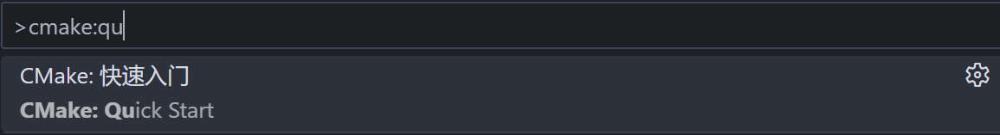
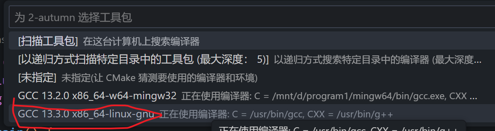
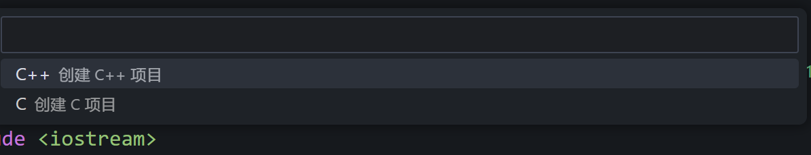
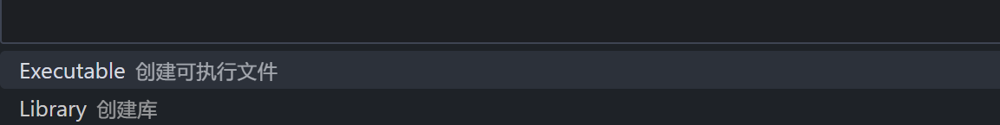
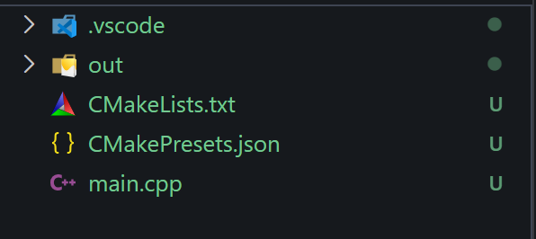
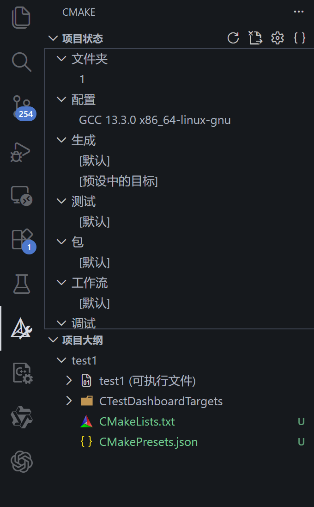

### 基础步骤
1. 将想要作为项目文件夹的文件夹使用vscode打开（因为默认是在根文件夹中创建项目）
2. `ctrl+shift_p,选择cmake:quick start`
   
3. 选择编译器
   
4. 项目名称
   
5. 创建c++项目
   
6. 选择类型
   

创建完成后可以得到这样的结构：


侧边栏可以看项目大纲：


点击三角号可运行：


点击虫子符号进行调试：


CMakeLists.txt文件：
```cmake
cmake_minimum_required(VERSION 3.10.0)
project(test1 VERSION 0.1.0 LANGUAGES C CXX)

add_executable(test1 main.cpp)

include(CTest)
enable_testing()

set(CPACK_PROJECT_NAME ${PROJECT_NAME})
set(CPACK_PROJECT_VERSION ${PROJECT_VERSION})
include(CPack)
```
相当于配置文件，可以进行一些配置，比如版本号，语言等等。

### 多文件运行
创建多个源文件，比如main.cpp和test.cpp，在CMakeLists.txt文件中添加如下内容：
```cmake
cmake_minimum_required(VERSION 3.10.0)
project(test2 VERSION 0.1.0 LANGUAGES C CXX)

add_executable(test2 main.cpp sum.cpp)

include(CTest)
enable_testing()

set(CPACK_PROJECT_NAME ${PROJECT_NAME})
set(CPACK_PROJECT_VERSION ${PROJECT_VERSION})
include(CPack)
```
关键是这一行：`add_executable(test2 main.cpp sum.cpp)`
将源文件添加到可执行文件中。

### 更好的结构
为了结构清晰，往往会将源文件放在src文件夹中，头文件放在include文件夹中，测试文件放在test文件夹中。
```
test2/
├─ CMakeLists.txt
├─ include/
│  └─ sum.h
├─ src/
│  ├─ main.cpp
│  └─ sum.cpp
└─ out/            (build 目录，建议不提交)
   └─ build/...

```
此时只需要对CMakeLists.txt进行修改：
```cmake
cmake_minimum_required(VERSION 3.10.0)
project(test2 VERSION 0.1.0 LANGUAGES C CXX)

add_executable(test2 
    src/main.cpp 
    src/sum.cpp)

target_include_directories(test2 PRIVATE
    ${CMAKE_CURRENT_SOURCE_DIR}/include)
include(CTest)
enable_testing()

set(CPACK_PROJECT_NAME ${PROJECT_NAME})
set(CPACK_PROJECT_VERSION ${PROJECT_VERSION})
include(CPack)
```
关键是两处地方：
1. `add_executable(test2 src/main.cpp src/sum.cpp)`指明源文件的路径
2. `target_include_directories(test2 PRIVATE ${CMAKE_CURRENT_SOURCE_DIR}/include)`指明头文件的路径


### 文件管理
一般来说，一个项目应该只包含源文件、头文件、测试文件、配置文件、文档等。也就是通过这些文件，可以在其他机器中使用这个项目，而编译出来的二进制文件、缓存文件、日志文件等都应该被忽略
忽略文件可以使用.gitignore文件，在项目根目录下创建.gitignore文件，并添加以下内容：
```
# ===== Build outputs (CMake / Make / Ninja) =====
build/
out/
cmake-build-*/
CMakeFiles/
CMakeCache.txt
CTestTestfile.cmake
Makefile
cmake_install.cmake
install_manifest.txt
compile_commands.json

# ===== Binaries / objects =====
*.o
*.obj
*.a
*.lib
*.so
*.dylib
*.dll
*.exe

# ===== Debug / misc =====
*.log
*.tmp

# ===== IDE =====
.vscode/
.idea/
*.code-workspace

# ===== OS =====
.DS_Store
Thumbs.db

```
这里面忽略了编译出来的二进制文件：`*.o,*.exe`等
忽略`/build,/out`等构建目录
忽略`.vscode,/.idea`等IDE文件`
忽略`*.log,*.tmp`等临时文件
这样提交的都是真正有用的干净的文件